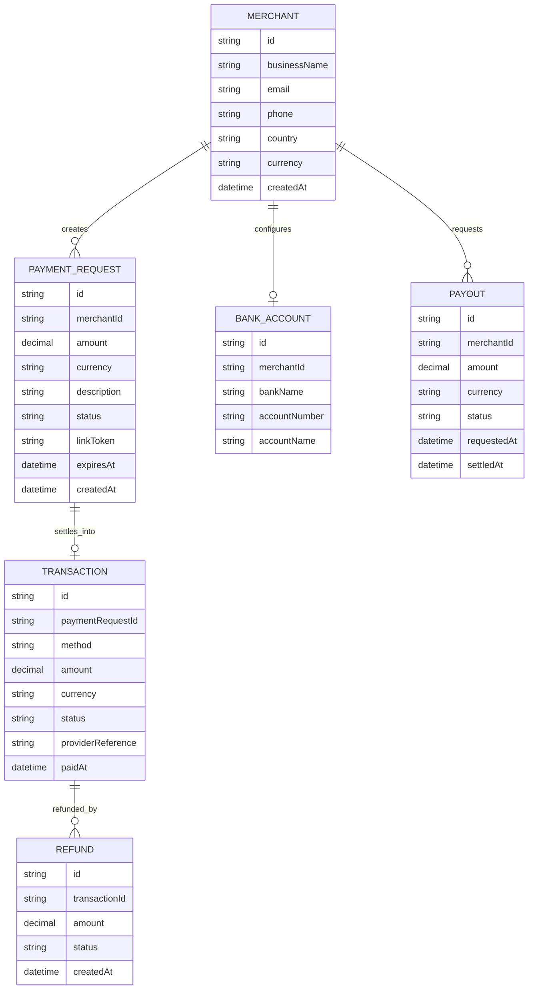

# Domain Model

The platform tracks merchants, the payment requests they issue, the
transactions those requests settle into, and the payouts that move a
merchant's balance to their bank account.

- **PAYMENT\_REQUEST** is what a merchant creates and shares as a link
(`linkToken`); it moves through `pending → paid/failed/expired`.
- **TRANSACTION** is the actual mobile-money or card charge a customer makes
against a payment request, processed by the internal payments API.
- **PAYOUT** moves a merchant's settled balance to their `BANK_ACCOUNT`, and is
always merchant-triggered.
- A **REFUND** reverses a completed transaction, at the merchant's request.

