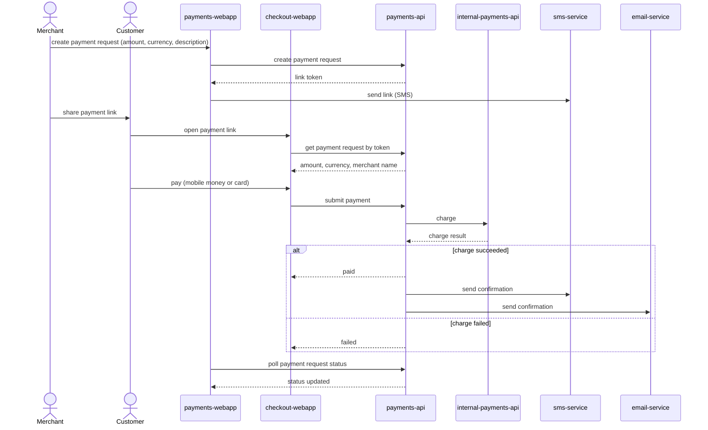

# Merchant collects a payment

A merchant creates a payment request and a customer pays it as a guest, with
both sides notified of the outcome.

```mermaid
sequenceDiagram
    actor Merchant
    actor Customer
    participant payments-webapp
    participant checkout-webapp
    participant payments-api
    participant internal-payments-api

    Merchant->>payments-webapp: create payment request (amount, currency, description)
    payments-webapp->>payments-api: create payment request
    payments-api-->>payments-webapp: link token
    payments-webapp->>sms-service: send link (SMS)
    Merchant->>Customer: share payment link

    Customer->>checkout-webapp: open payment link
    checkout-webapp->>payments-api: get payment request by token
    payments-api-->>checkout-webapp: amount, currency, merchant name
    Customer->>checkout-webapp: pay (mobile money or card)
    checkout-webapp->>payments-api: submit payment
    payments-api->>internal-payments-api: charge
    internal-payments-api-->>payments-api: charge result
    alt charge succeeded
        payments-api-->>checkout-webapp: paid
        payments-api->>sms-service: send confirmation
        payments-api->>email-service: send confirmation
    else charge failed
        payments-api-->>checkout-webapp: failed
    end
    payments-webapp->>payments-api: poll payment request status
    payments-api-->>payments-webapp: status updated
```

