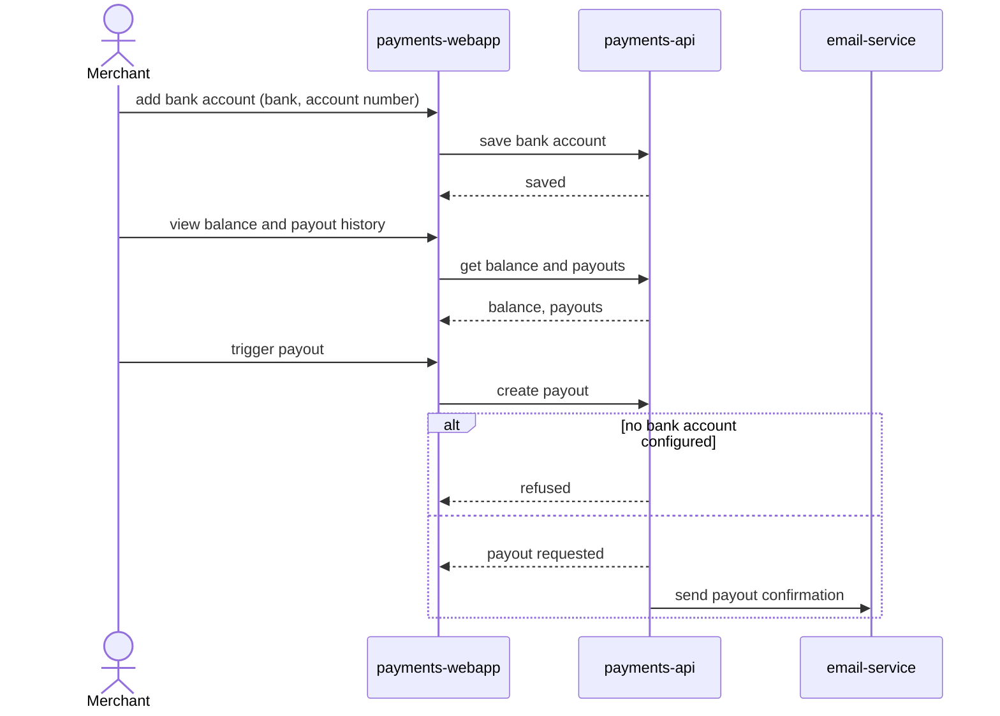

# Merchant configures payout and cashes out

A merchant sets up a bank account, then triggers a payout of their settled
balance whenever they choose.

```mermaid
sequenceDiagram
    actor Merchant
    participant payments-webapp
    participant payments-api

    Merchant->>payments-webapp: add bank account (bank, account number)
    payments-webapp->>payments-api: save bank account
    payments-api-->>payments-webapp: saved

    Merchant->>payments-webapp: view balance and payout history
    payments-webapp->>payments-api: get balance and payouts
    payments-api-->>payments-webapp: balance, payouts

    Merchant->>payments-webapp: trigger payout
    payments-webapp->>payments-api: create payout
    alt no bank account configured
        payments-api-->>payments-webapp: refused
    else
        payments-api-->>payments-webapp: payout requested
        payments-api->>email-service: send payout confirmation
    end
```

